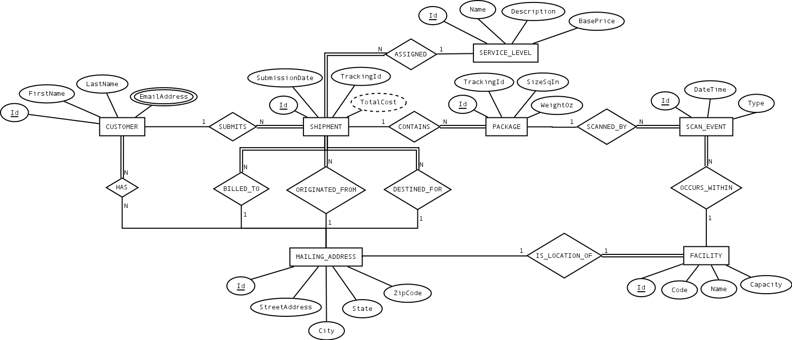
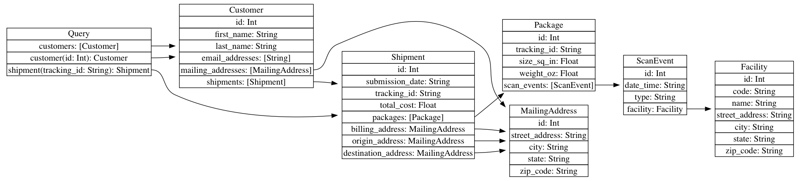

# Introduction to package-tracking

This service basically maps an relational schema to a GraphQL schema.

## The database schema

Here's the database schema:

## The GraphQL schema

Here is the GraphQL schema:

